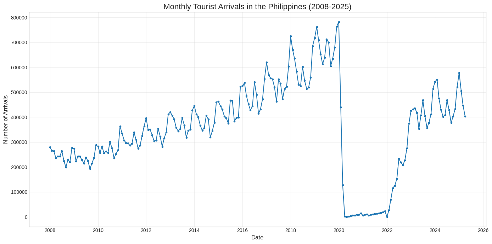
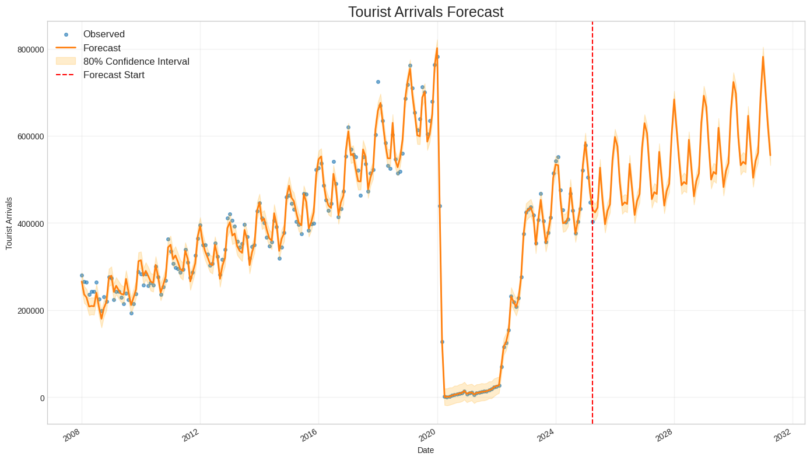
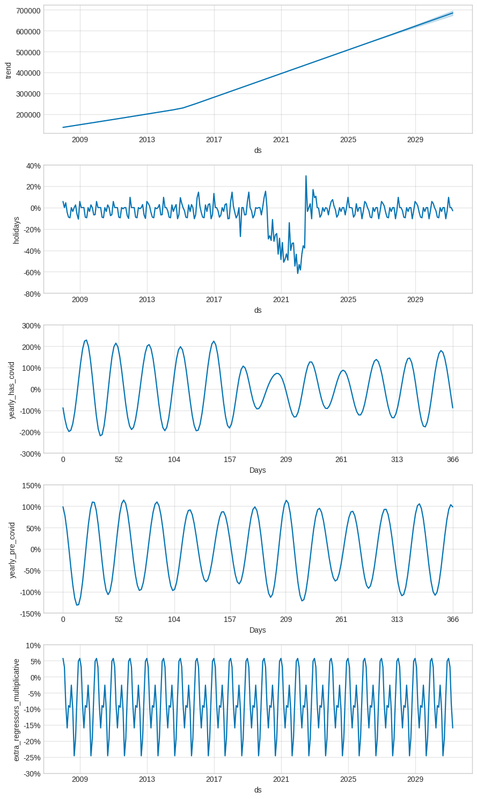

# 🏝️ Philippines Tourist Arrivals Forecasting System

A comprehensive forecasting web application that predicts tourist arrivals to the Philippines using advanced time series analysis with Facebook Prophet. Built with React, Vite, TailwindCSS, Python Flask, and Prophet.


> **NOTE**: The data used for the training of the model discussed in this README is a more aggregated version of the dataset. 

## 🎯 What This System Does

This forecasting system provides two key predictions:
- **Time-based forecasts**: Predict tourist arrivals months or years ahead
- **Country-based insights**: Identify which countries of residence will likely contribute the most tourists

## 📊 Dataset Overview

The system uses publicly available monthly tourist arrival data from the **Department of Tourism of the Philippines**, spanning from **2008 to April 2025**. The dataset structure is straightforward:

```
Date        Arrivals
2008-01-01  279338
2008-02-01  265827
2008-03-01  263862
2008-04-01  235895
2008-05-01  242822
```

## 📈 Raw Data Visualization



The raw data reveals fascinating patterns in Philippine tourism, with steady growth from 2008 until a dramatic disruption in 2020. The most striking feature is the **sudden and severe downfall of tourist arrivals beginning in March 2020**, coinciding with the global COVID-19 pandemic. Tourist numbers plummeted from hundreds of thousands per month to near-zero levels, remaining critically low through the early months of 2022 as international travel restrictions persisted.

The component analysis reveals several key insights:

1. **Long-term Trend**: The first panel shows a clear upward trajectory from 2008 to 2019, reaching approximately 700,000 monthly arrivals before the pandemic struck.

2. **Holiday Effects**: The second panel demonstrates significant negative impacts during COVID-19 periods, with the most severe disruption occurring in 2020-2021, reaching nearly -60% impact.

3. **Seasonal Patterns**: The third and fourth panels reveal distinct seasonality components:
   - **Yearly COVID Seasonality**: Shows consistent annual patterns with peaks and troughs, indicating regular seasonal tourism flows that were disrupted but maintained their cyclical nature
   - **Pre-COVID Seasonality**: Displays the traditional tourism seasonality with regular annual cycles, showing peak months typically occurring in certain periods of the year

4. **Monthly Regressors**: The bottom panel shows the impact of individual months, with consistent patterns indicating strong month-to-month variations in tourist arrivals, ranging from approximately -25% to +5% depending on the month.

## 🔧 Data Preprocessing

### Missing Value Interpolation

The dataset contained a missing value for **January 2022**. We handled this by interpolating using the mean of its neighboring months (December 2021 and February 2022). 

> **Note**: This is a temporary solution and is subject to change as more sophisticated imputation methods may be implemented in future versions.

### Handling COVID-19 Impact

The COVID-19 pandemic created an unprecedented shock to the tourism industry that traditional forecasting models struggle to handle effectively.

> To prevent large dips and spikes from being captured by the trend component, we can treat the days impacted by COVID-19 as holidays that will not repeat again in the future

Based on our plotted data analysis, we identified key periods where COVID-19 significantly impacted tourist arrivals. These dates are adjusted to the first of the month since we have monthly aggregated data.

**Reference**: [Prophet - Handling Shocks](https://facebook.github.io/prophet/docs/handling_shocks.html)

#### COVID-19 Holiday Periods

| Holiday Name | Start Date | End Date | Description |
|--------------|------------|----------|-------------|
| covid_impact_1 | 2020-02-01 | 2020-12-01 | First major drop when arrivals began declining |
| covid_impact_2 | 2021-01-01 | 2021-12-01 | Continued low levels throughout 2021 |
| covid_recovery | 2022-01-01 | 2022-07-01 | Recovery period in first half of 2022 |

**Implementation**:
```python
lockdowns = pd.DataFrame([
    {
        'holiday': 'covid_impact_1',
        'ds': '2020-02-01',
        'lower_window': 0,
        'ds_upper': '2020-12-01'
    },
    {
        'holiday': 'covid_impact_2',
        'ds': '2021-01-01',
        'lower_window': 0,
        'ds_upper': '2021-12-01'
    },
    {
        'holiday': 'covid_recovery',
        'ds': '2022-01-01',
        'lower_window': 0,
        'ds_upper': '2022-07-01'
    }
])
```

### Philippine Holidays Integration

We incorporated Philippine national holidays using the `holidays` package, generating holidays from 2008 to 2025. However, since our dataset uses monthly aggregated data, all holidays are adjusted to the first day of their respective months.

**Rationale**: For monthly data, Prophet requires holidays to align with the data frequency. Christmas Eve (December 24) becomes December 1, New Year's Day (January 1) remains January 1, etc.

#### Original vs. Adjusted Holiday Dates

**Original Philippine Holidays (Sample)**:
| Holiday | Original Date | Month |
|---------|---------------|-------|
| New Year's Day | January 1 | January |
| EDSA People Power Revolution | February 25 | February |
| Maundy Thursday | April 9 (varies) | April |
| Good Friday | April 10 (varies) | April |
| Araw ng Kagitingan | April 9 | April |
| Labor Day | May 1 | May |
| Independence Day | June 12 | June |
| Christmas Eve | December 24 | December |
| Christmas Day | December 25 | December |
| Rizal Day | December 30 | December |

**Adjusted for Monthly Data**:
| Holiday | Adjusted Date | Reasoning |
|---------|---------------|-----------|
| New Year's Day | January 1 | Already first of month |
| EDSA People Power Revolution | February 1 | Moved to first of February |
| Maundy Thursday | April 1 | Moved to first of April |
| Good Friday | April 1 | Moved to first of April |
| Araw ng Kagitingan | April 1 | Moved to first of April |
| Labor Day | May 1 | Already first of month |
| Independence Day | June 1 | Moved to first of June |
| Christmas Eve | December 1 | Moved to first of December |
| Christmas Day | December 1 | Moved to first of December |
| Rizal Day | December 1 | Moved to first of December |

**Reference**: [Prophet - Holidays with Aggregated Data](https://facebook.github.io/prophet/docs/non-daily_data.html#holidays-with-aggregated-data)

## 🤖 Model Configuration

### Seasonality Settings

We configured the Prophet model with **multiplicative seasonality** for several compelling reasons:

1. **Growing Trend**: The dataset shows a clear upward trend over time, making multiplicative seasonality more appropriate
2. **Prophet Hypertuning**: Automated hyperparameter tuning confirmed multiplicative seasonality as optimal
3. **Caveat**: Multiplicative seasonality can be problematic with true zero values in the data, which we need to respect

### Custom Seasonality Periods

We implemented custom seasonality to capture different behavioral patterns:

- **Pre-COVID Phase** (Dataset start → February 2020): Normal tourism patterns
- **COVID-Impact Phase** (March 2020 → July 2023): Disrupted patterns due to pandemic effects
- **No Post-COVID Seasonality**: Adding post-COVID seasonality led to poor forecast results, and pre-COVID patterns appear to be re-emerging

### Monthly Regressors

We added 12 monthly binary regressors to capture month-specific effects, as recommended by Prophet documentation for monthly data.

### Model Performance Comparison

| Configuration | R² Score | Improvement over Base |
|---------------|----------|----------------------|
| Base Model (No Binary Month Regressors & No COVID Seasonality) | 0.915 | - |
| With Binary Month Regressors Only | 0.914 | -0.001 |
| With COVID Seasonality Only | 0.902 | -0.013 |
| **With Both Features** | **0.935** | **+0.020** |

The combination of custom seasonality and monthly regressors provided the most significant improvement, increasing the R² score by 2 percentage points.

**References**:
- [Prophet - Monthly Data](https://facebook.github.io/prophet/docs/non-daily_data.html#monthly-data)
- [Prophet - Fourier Order for Seasonalities](https://facebook.github.io/prophet/docs/seasonality,_holiday_effects,_and_regressors.html#fourier-order-for-seasonalities)
- [Prophet - Changes in Seasonality (COVID)](https://facebook.github.io/prophet/docs/handling_shocks.html#changes-in-seasonality-between-pre--and-post-covid)
- [Prophet - Built-in Country Holidays](https://facebook.github.io/prophet/docs/seasonality,_holiday_effects,_and_regressors.html#built-in-country-holidays)

## 🔮 Forecasting Approach

Following Prophet's best practices for monthly data, we use **'MS' (Month Start) frequency** for our future dataframes. This aligns perfectly with our dataset structure where each observation represents the first day of its respective month.

Prophet documentation indicates that for monthly data, forecasts should be made at monthly intervals or longer periods, which suits our application's requirements perfectly.

## 📊 Forecast Results

### Main Forecast Plot



The forecast results demonstrate exceptional model performance and reveal compelling insights about Philippine tourism recovery:

**Key Observations:**
- **Excellent Historical Fit**: The orange forecast line closely tracks the blue observed data points throughout the historical period (2008-2025), indicating strong model accuracy
- **COVID-19 Handling**: The model effectively captures the dramatic drop to near-zero arrivals during 2020-2021, showing how the COVID-19 holidays successfully isolated this unprecedented shock
- **Recovery Trajectory**: The forecast shows a realistic recovery pattern starting in 2022, gradually returning toward pre-pandemic levels
- **Future Projections**: Post-2025 forecasts (beyond the red dashed line) show continued growth with seasonal variations, reaching approximately 500,000-800,000 monthly arrivals
- **Confidence Intervals**: The shaded confidence band appropriately widens for future periods, reflecting increasing uncertainty over longer forecast horizons
- **Seasonal Patterns**: Clear seasonal fluctuations are visible throughout both historical and forecasted periods, indicating the model captures recurring tourism patterns

The forecast demonstrates that while COVID-19 created an unprecedented disruption, the underlying tourism fundamentals remain strong, with the model projecting a return to robust growth patterns.

### Component Analysis



The forecast components provide detailed insights into the underlying patterns driving Philippine tourism:

**Trend Component (Top Panel)**:
- Shows steady exponential growth from ~150,000 monthly arrivals in 2008 to nearly 700,000 by 2019
- Maintains growth momentum through the forecast period, reaching similar pre-pandemic trajectories
- The smooth trend indicates strong underlying tourism fundamentals despite temporary disruptions

**Holiday Effects (Second Panel)**:
- Dramatically illustrates the COVID-19 impact with holiday effects reaching -60% during peak pandemic periods
- Shows the recovery pattern with effects gradually returning to baseline levels post-2022
- Validates our approach of treating COVID-19 as non-recurring holiday events

**Yearly Seasonality Components**:
- **COVID Seasonality** (Third Panel): Captures pandemic-era seasonal patterns with modified amplitude and timing
- **Pre-COVID Seasonality** (Fourth Panel): Preserves the traditional tourism seasonality that characterizes normal years
- Both components show cyclical patterns with roughly ±100% to ±150% seasonal effects

**Monthly Regressors (Bottom Panel)**:
- Reveals consistent month-to-month variations ranging from -25% to +5%
- Shows certain months consistently perform better/worse regardless of year
- Indicates strong monthly patterns in Philippine tourism (likely driven by weather, holidays, and international travel preferences)

### Model Performance Metrics

| Metric | Value | Interpretation |
|--------|-------|----------------|
| **MAE** | 0.0139 | Mean Absolute Error (normalized) |
| **MSE** | 0.000382 | Mean Squared Error (normalized) |
| **RMSE** | 0.01956 | Root Mean Squared Error (normalized) |
| **MAPE** | 4.5% | Mean Absolute Percentage Error |

The MAPE of 4.5% indicates excellent forecast accuracy, with the model's predictions typically within 5% of actual values.

## 🛠️ Technology Stack

- **Frontend**: React + Vite + TailwindCSS
- **Backend**: Python Flask
- **Forecasting**: Facebook Prophet
- **Data Processing**: pandas, numpy
- **Visualization**: matplotlib, plotly

## 🚀 Getting Started

1. Clone the repository
2. Install dependencies for both frontend and backend
    - Do a `npm install` inside the client folder
    - Then, do a `pip install -r requirements.txt` inside the server folder
3. Run the Flask backend server (`python3 app.py` or `python app.py`)
4. Start the React development server (`npm run dev`)
5. Access the application through your browser

---

> The content of the README.md is a human-supervised AI generated content. If there's something confusing about the brief README, then feel free to create a query thru GitHub issues.